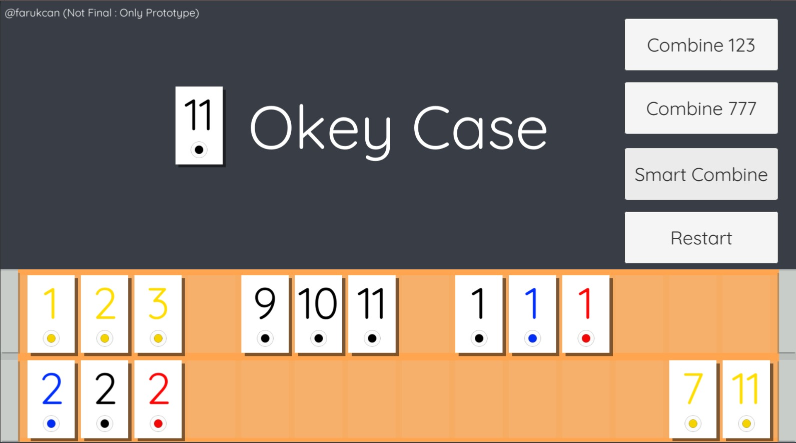
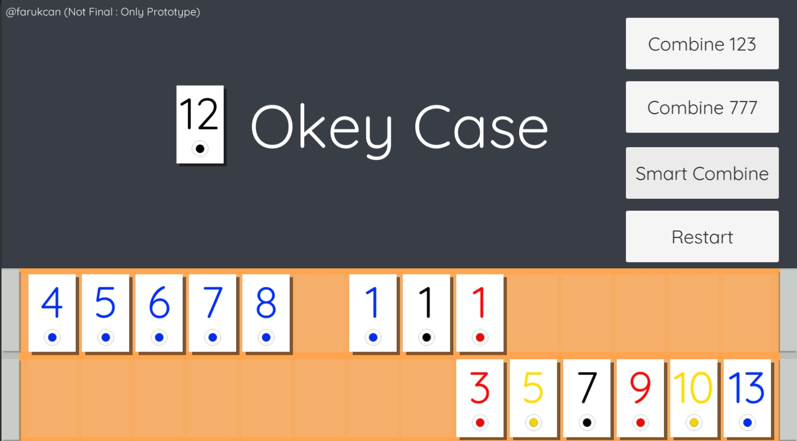

# Documents

This repository is a prototype for Turkish Okey Game

### Demo 

* Please check "Releases" on github for APK files.

## Structre

* /docs : Documents
* /release : apks and build files (ignored on git)
* /server : server/backend with node.js
* /unity : Unity Engine files and scripts
  * /unity/OkeyCase/Assets/Animations : animations
  * /unity/OkeyCase/Assets/Fonts : fonts
  * /unity/OkeyCase/Assets/OkeyGame  : library , classes , algoritms
  * /unity/OkeyCase/Assets/Scripts :  Controllers and UI Scripts
  * /unity/OkeyCase/Assets/Tests : Unit Tests for OkeyGame Library
  * /unity/OkeyCase/Assets/Scenes/scene : scene

## Screenshots

### Video

### 1

### 2

## TODO

- [x] Card Class
- [x] Deck Class
- [x] Table Class
- [x] Distribution of cards
- [x] 123 Combine Algorithm
- [x] 777 Combine Algorithm
- [x] Smart Combine Algorithm
- [x] Test Case's of Algorithms
- [x] Distribution Animation
- [x] The Deck and The Table UI
- [x] Polling for Cards
- [x] Drag and Drop on Deck
- [x] Okey Card Indicator
- [x] 123 Combine Button
- [x] 777 Combine Button
- [x] Smart Combine Button
- [x] Locating card groups to the deck ( 2 row with 14 slots and 1 slot spacing)
- [x] After Combine Animations
- [x] Reverse the okey cards when long touch
- [x] Mobile compatibility
